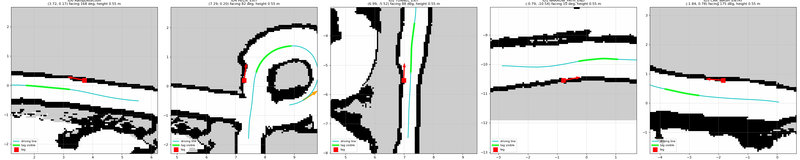

# AprilTag Survey with Manual Drive

**Goal:** find where each AprilTag sits in the map (x, y, height and the
direction it faces), so that during autonomous runs every sighting of a tag
can correct the robot's position, like an RTK fix.

**Planned positions (from the map) are already filled in**, see section 3. The
survey checks and refines them after mounting.

**Output:** a few lines that go into
`src/course_supervisor/config/tag_map_obstacle_course.yaml`, e.g.

```yaml
tags:
  2: {x: 7.45, y: -6.10, z: 0.13, facing_deg: 88.0, samples: 25}
```

**Time:** about 30 minutes: mount tags, one slow manual lap, copy the result.

---

## 1. How it works (short version)

* `zed_apriltag` detects tags in the ZED left image and publishes, for every
  tag it sees, its ID, its label and its 3D pose relative to the camera.

* `course_supervisor` (in survey mode) combines that with the robot's map pose
  from `mcl_3dl`. It averages *robot pose + tag offset* over all sightings and
  writes the tag's map pose to a file every 5 s and on Ctrl-C.

* Sightings are recorded **only** where lidar localization is trusted
  (course sections with `lidar: true`), within 2 m of the tag (`tag_max_range`).

* **Detection range:** the plan assumes `zed_apriltag` reports tags up to
  **2.0 m** away. If your Jetson copy limits detection (e.g. to 1 m), set
  that limit to 2.0 m. The section switches still happen close to the tag
  (`trigger_range` ≤ 1 m); the extra range only adds earlier fixes.

* You drive the robot with the **joystick** the whole time. In survey mode the
  supervisor drives nothing.

## 2. What you need

| Item | Notes |
|---|---|
| Printed tags | Family **tag36h11**, IDs from the table in section 3. Note the **edge length of the black square** in metres; you pass it as `tag_size` (default 0.16). |
| Mounting | Something rigid, upright, at about camera height (centre ~25 cm above the floor). |
| Jetson workspace | Built with `zed_apriltag` and `course_supervisor` (`colcon build --packages-select zed_apriltag course_supervisor`). `zed_apriltag` needs OpenCV ≥ 4.7. |
| Map | `diy_localization/map/Obstacle_course/mcl_map.pcd` (the corrected v2 map) loaded by `mcl_3dl`. |
| Drive stack | driveStack on the Raspberry Pi, in **manual** (joystick) mode. |

## 3. Which tags, where

The placements below were chosen on the corrected 2D map
(`obstacle_course_clean.pgm`) with `plan_tags`.
* **Why on top of the wall:** in a straight lane no wall surface faces the
  robot, so each tag stands **on top of a lane wall** (the side in the
  table), **right at its inner edge**, with the printed face **turned back
  toward the approaching robot**. Nothing sticks into the lane (this matters
  in the 20 in lane). In the wide lanes (after the gravel, car wash) the tag
  goes on the wall that keeps it inside the camera view.
* **Planned map poses:** these are already in
  `config/tag_map_obstacle_course.yaml` (centre height 0.55 m assumed). Mount
  the tags as described and the fixes work without a survey. The survey (or a
  measurement) then refines them.

Tag labels live in `src/aprilTag/config/tag_labels.yaml` (set for IDs 0–4).
The supervisor matches section triggers by the **label text**.

| Priority | ID | Label | Where (on top of the wall) | Map x, y | Face points to | Seen while robot at s | Does |
|---|---|---|---|---|---|---|---|
| **Must** | 0 | `RampDetection` | **Ramp entry**, **left** wall at the foot of the 20 % ramp (s 3.65) | (3.72, 0.17) | 168° | 1.75–3.20 | Fix + switches to the ramp push-through (`trigger_range` 0.95, fires at s 2.70); on lap 2 it re-syncs before the odometry-only stretch |
| **Must** | 2 | `TUNNEL_EXIT` | **Tunnel exit**, **right** wall, first bale of the 20 in lane, 0.4 m past where 32 in becomes 20 in (s 19.6) | (6.99, −5.52) | 88° (back into the tunnel) | 17.65–19.30 (from inside the tunnel looking out) | Fix + switches to the wall follower (`narrow_path`, `trigger_range` 0.42, fires at the exit s 19.18) |
| **Must** | 1 | `NARROW_PATH_END` | **Just after the gravel** (past the 2 in ramp down), **left** wall (s 31.2) | (−0.79, −10.54) | 10° | 29.25–30.55 | Fix + hands over from the wall follower to Nav2 at full speed (`after_gravel_to_hoops`, `trigger_range` 0.89, fires at s 30.31) |
| **Must** | 3 | `CAR_WASH_ENTRY` | **Car wash entry**, **left** wall ~0.8 m into the car wash (s 72.6) | (−1.84, 0.78) | 175° | 70.65–71.80 | Fix + switches to the car wash push-through (`trigger_range` 0.82, fires at the car wash start s 71.78). Mount it where no ribbon hangs between it and the lane |
| Opt. | 4 | `HELIX_EXIT` | Helix bottom, before the bridge (not under the deck), **right** wall (s 13.9) | (7.29, 0.20) | 82° | 12.00–13.55 | Fix only (after ~11 m of odometry) |



*Red square = tag, red arrow = direction the printed face points, green =
part of the driving line from which the robot sees it (0.3–2 m, inside the
camera view, clear line of sight).*

To move a tag, edit `config/tag_plan_obstacle_course.yaml` (`s` = metres
along the driving line, `side`, `height`) and re-run:

```bash
ros2 run course_supervisor plan_tags --plan src/course_supervisor/config/tag_plan_obstacle_course.yaml \
  --course src/course_supervisor/config/obstacle_course.yaml --figure /tmp/tag_plan.png
```

It prints the new tag-map lines and the `trigger_range` values for the template.

### Mounting rules

1. **On top of the wall given in the table**, right at its inner edge (tag
   centre ~3 cm behind the inner face, plate flush with the face), on a
   short post or block so the tag centre is about **0.5–0.6 m above the floor**.
   Measure the actual height. Tag-map `z` = height − 0.12.
2. **Upright** (vertical), flat, rigid backing.
3. **Turned to face back down the lane** toward the approaching robot
   (perpendicular to the lane direction). *Not* flat along the wall: seen
   edge-on, it won't be detected.
4. **Nothing in the lane.** The plate must not overhang the inner edge of the wall.
5. **Light:** matte print, no glare. The tunnel-exit tag is outside the
   tunnel, in daylight.
6. **Fixed:** the tag must not move after the survey/measurement.

## 4. Before the run: checks on the Jetson

### 4.1 Camera → robot transform (TF)

The robot pose from a tag needs the camera's position on the robot. Check:

```bash
# Frame of the image the detector uses (usually zed_left_camera_frame_optical)
ros2 topic echo /zed/zed_node/rgb/color/rect/image --field header.frame_id --once

# Full chain robot -> camera (should print a translation, not an error)
ros2 run tf2_ros tf2_echo base_footprint zed_left_camera_frame_optical
```

* **Chain works:** nothing to do.
* **Chain missing:** usually one of:
    * `robot_description` not running (it provides `base_link → zed_camera_link`);
    * the ZED root frame has a different name (e.g. `zed2i_camera_link`). Bridge it:
    `ros2 run tf2_ros static_transform_publisher --frame-id zed_camera_link --child-frame-id zed2i_camera_link`;
    * the ZED wrapper isn't publishing its URDF (`publish_urdf` false).
* **Or skip TF entirely:** the supervisor falls back to the camera mount in
  `course_supervisor/config/course_supervisor.yaml`:
  `camera_offset_xyz: [0.21, 0.08, 0.24]` (base_footprint → ZED **left** lens,
  metres) and `camera_offset_rpy: [0, 0, 0]` (looking straight ahead). Measure
  and update it. The log says `using camera_offset_xyz/rpy` when the fallback
  is in use. The survey and later fixes use the same value, so a small error
  largely cancels.

### 4.2 Tag size

`tag_size` must equal the printed black-square edge length in metres. A wrong
size scales every distance (a 10 % size error moves the tag 10 % further or
closer).

## 5. Launch (one terminal each)

**Raspberry Pi: drive stack in manual (joystick) mode**

```bash
ros2 launch bringup manual_ackermann.launch.py     # joystick -> /joy_cmd_vel -> ackermann-drive
```

In manual mode the drive listens to `/joy_cmd_vel` only, so nothing the
supervisor publishes can move the robot.

**Jetson** (same as the obstacle-course bringup, without Nav2):

```bash
ros2 launch zed_wrapper zed_camera.launch.py camera_model:=zed2i
ros2 launch robot_description description.launch.py
ros2 run diy_state_estimate zed_base_odom_relay --ros-args \
  -p zed_odom_topic:=/zed/zed_node/odom -p output_topic:=/odom \
  -p odom_frame:=odom -p base_frame:=base_footprint -p publish_tf:=true
cd ~ && ./hesai_launch.sh
ros2 launch fast_lio_ros2 lio_localizer.launch.py publish_tf:=false output_topic:=/Odometry_fastlio
ros2 launch mcl_3dl mcl_localizer.launch.py \
  cloud_topic:=/cloud_registered_body imu_topic:=/imu/data odom_topic:=/odom
```

Leave `mcl_3dl`'s lidar gate **off** for the survey (default). Then the survey
recorder, with every controller off:

```bash
ros2 launch course_supervisor course_supervisor.launch.py \
  use_nav2:=false use_wall_follower:=false use_path_tracker:=false \
  wait_for_green_light:=false \
  start_apriltag:=true tag_size:=0.16 \
  tag_survey_file:=/home/juggernauts/tag_survey.yaml
```

* `use_*:=false`: the supervisor drives nothing (it publishes zero speed, which
  the manual-mode drive ignores).

* `wait_for_green_light:=false`: progress along the course is tracked from the
  start, so the recorder knows which section (lidar on/off) the robot is in.

* Use a path in your home folder. `/tmp` is wiped on reboot.

## 6. Drive the survey lap

1. **Start pose:** put the robot where the map run started (start lane, facing
   down the lane), or give `mcl_3dl` a *2D Pose Estimate* in RViz. Check in
   RViz that the scan lines up with the map.

2. Drive the course in the normal direction, **slowly** (≤ 0.3 m/s).
3. At each tag: approach in the lane centre, **stop 1–2 m in front of it for
   3–5 s**, then drive past. That gives 10+ samples per tag.

4. Keep an eye on localization: if the scan stops matching the map in RViz,
   stop, fix the pose (2D Pose Estimate), and redo that tag.

5. At the end press **Ctrl-C** in the supervisor terminal (writes the file).

### Live checks while driving

```bash
ros2 topic echo /apriltag/tag_info          # tag seen? id + label
ros2 topic echo /course_supervisor/state    # section, s along the course, pose ok
cat /home/juggernauts/tag_survey.yaml       # updated every 5 s while a tag is seen
```

## 7. After the run

**Step 1.** Open `/home/juggernauts/tag_survey.yaml`. It looks like:

```yaml
tags:
  1: {x: 5.31, y: -10.42, z: 0.13, facing_deg: 7.5, samples: 31}
```

**Step 2. Sanity-check each line:**

* `samples` ≥ 10;
* `x, y` within ~0.5 m of the expected position in section 3;
* `facing_deg` within ~10° of *robot heading + 180*;
* `z` about camera height minus 0.12 (the map floor is at z ≈ −0.12).

**Step 3.** Copy the lines under `tags:` into
`src/course_supervisor/config/tag_map_obstacle_course.yaml`
(`samples` may stay, it's ignored).

**Step 4.** Rebuild so the installed copy updates
(`colcon build --packages-select course_supervisor`), or pass the file
directly: `tag_map_file:=<path>`.

## 8. Tags the survey can't record (e.g. tunnel exit)

The tunnel-exit tag is seen mostly from inside the tunnel, where lidar
localization is off, so the survey may skip it. Keep the **planned** entry
(section 3) if the tag is mounted as planned, or measure it:

1. In RViz (fixed frame `map`, the map cloud shown), use **Publish Point** on
   the wall spot where the tag is, and read it from
   `ros2 topic echo /clicked_point`.

2. `facing_deg` = robot heading at that spot + 180 (tunnel exit: 88).
3. `z` = tag-centre height above the floor − 0.12.
4. Add the line: `2: {x: 7.45, y: -6.10, z: 0.13, facing_deg: 88.0}`.

**Alternative, no tag map at all:** write the pose into the label in
`aprilTag/config/tag_labels.yaml`:

```yaml
ID2: "TUNNEL_EXIT @ 7.45, -6.10, 0.13, 88"     # x, y, [z,] facing_deg
```

Triggers still match the name before `@`. Entries in the tag map file take
precedence over label poses.

## 9. Troubleshooting

| Symptom | Cause / fix |
|---|---|
| `/apriltag/tag_info` empty | ZED not running, wrong `image_topic`, tag too far / small / glare, wrong family (must be tag36h11). |
| Log: `no TF base_footprint -> tag_N` and no fallback message | `camera_tf_fallback` set false; set it true or fix the TF chain (section 4.1). |
| Survey file never written | Tag seen only where `lidar: false` (ramp, helix, tunnel, car wash), or > 2 m away (check the `zed_apriltag` detection limit), or `tag_survey_file` empty. Use section 8 for those tags. |
| `samples` very low | Drove past too fast; stop in front of the tag for a few seconds. |
| Position off by > 0.5 m | Localization was wrong during the survey (check RViz), or `tag_size` wrong. Redo that tag. |
| `facing_deg` far from expected | Tag mounted at an angle or not upright; fix the mount and redo. |
| Supervisor error `zed_apriltag messages not found` | `zed_apriltag` not built/sourced in this workspace. |
