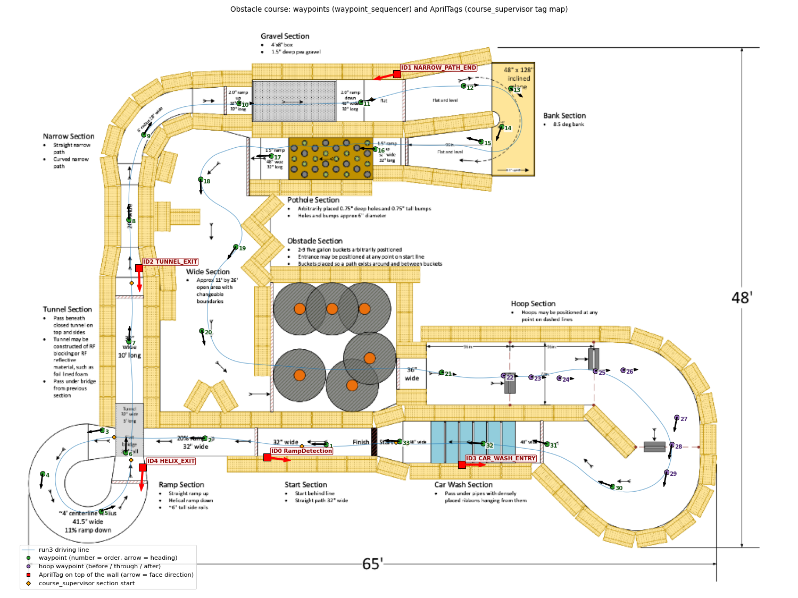

# Course Supervisor: Pipeline and Testing Guide

Package: `src/course_supervisor` (branch `dev_juggernauts_v3.0`).
Everything here is **opt-in**. The existing obstacle-course setup
(`obstacle_course_jetson.sh`, `nav2_navigation_mppi_*_obstacle_course_ackermann.launch.py`)
is unchanged and remains the fallback.

---

## 1. What it does

The obstacle course has sections where one controller is the right tool and
others fail:

* **Ramp, bridge, helix:** the costmap sees the 20 % ramp as a wall, and the
  wall follower can't see the 6 in rails.

* **Closed tunnel:** lidar localization is unreliable (pushed through on odometry).
* **Narrow path** (tunnel exit → 20 in lane → 26 in turn → gravel box): very narrow,
  driven slowly by the wall follower. Nav2 takes over at full speed once the
  `NARROW_PATH_END` tag after the gravel is seen.

* **Car wash:** hanging ribbons look like walls to both the costmap and the
  wall follower. Pushed through; the `CAR_WASH_ENTRY` tag (or odometry
  progress) starts it.

* **Everything else:** the open sections with buckets, hoops and gravel need
  Nav2 (MPPI) with obstacle avoidance.

`course_supervisor` knows where the robot is along the course and, per
section, picks **one** controller to drive. Optionally it also turns
`mcl_3dl` lidar matching off where it can't be trusted, and uses AprilTags as
position fixes and section triggers.

## 2. Architecture

```
                 mcl_3dl (map -> odom) ----+          zed_apriltag (/apriltag/tag_info + TF)
                                           |                         |
                                           v                         v
  +------------------------------------ course_supervisor --------------------------------------+
  | progress s along the course line -> section -> mode (nav2 / wall_follower / path_tracker / stop)|
  +--+--------------------+--------------------+-------------------+-------------------+----------+
     | FollowPath goal    | enable Bool        | (built in)        | lidar gate Bool   | tag pose fix
     v                    v                    v                   v                   v
 controller_server   mapless_wall_follower  path tracker    mcl_measurement_enabled  mcl_measurement
 (MPPI, local costmap)                      (pure pursuit)      -> mcl_3dl            -> mcl_3dl
     | /cmd_vel_mppi      | /cmd_vel_wall_follower
     +--------+-----------+------------------+
              v (selected)
   nav2 / path_tracker: -> cmd_vel_mppi_raw -> velocity_smoother
                        -> /cmd_vel_smoother_out -> supervisor -> /cmd_vel_smoothed
   wall_follower:       -> supervisor -> /cmd_vel_smoothed (direct, like standalone)
                                                                          |
                                                                          v
                                                         ackermann-drive (driveStack)
```

**Key rules:**

* **One driver.** `/cmd_vel_smoothed` is what `ackermann-drive` listens to
  (`Twist`: `linear.x` = speed, `angular.z` = yaw rate, 1 s watchdog).
  `course_supervisor` is the **only** node publishing it.

* **Nav2 and path tracker go through the velocity smoother** (acceleration
  limits, forward-only).

* **The wall follower bypasses the smoother.** It keeps its own rate limits
  and its reverse recovery, which the forward-only smoother would block.

* **No restarts on a switch.** Switching controllers only changes which input
  is forwarded.

## 3. The course file

`config/obstacle_course.yaml`: the run3 driving line (74.6 m, map frame of
`mcl_map.pcd`, 5 cm spacing) and the sections. It's generated from
`config/obstacle_course_template.yaml`.

| Section | Starts at s (m) | Mode | mcl_3dl lidar | Tracker speed | Tag trigger |
|---|---|---|---|---|---|
| start_lane | 0.0 | nav2 | on | | |
| ramp_and_bridge | 2.7 | path_tracker | **off** | 0.30 | `RampDetection` ≤ 0.95 m |
| helix | 8.1 | path_tracker | **off** | 0.25 | |
| tunnel | 14.1 | path_tracker | **off** | 0.30 | |
| narrow_path (tunnel exit → 20 in lane → 26 in turn → gravel) | 19.2 | wall_follower | on | | `TUNNEL_EXIT` ≤ 0.42 m |
| after_gravel_to_hoops | 30.3 | nav2 | on | | `NARROW_PATH_END` ≤ 0.89 m |
| car_wash | 71.8 | path_tracker | **off** | 0.35 | `CAR_WASH_ENTRY` ≤ 0.82 m |
| finish | 74.2 | nav2 | on | | |

**Progress (s):**

* **How it's measured:** the robot's map pose (TF `map → base_footprint` from
  `mcl_3dl`) is projected onto the driving line, but only within
  [s − 0.5 m, s + 2.5 m] of the current progress.

* **s never goes back.** A parallel lane elsewhere (e.g. the tunnel next to
  the wide section) can't capture it, and pose drift can't send it back a
  section.

* **Lost:** more than 1.5 m off the line counts as "lost". Progress freezes,
  and the path tracker stops.

**Laps:** the run is **2 laps** (`laps:=2`, the default). The course line ends
next to where it starts. When progress reaches the end with laps remaining,
it restarts at s = 0, and the Nav2 path already continues into the next lap.
After the last lap the robot stops within 0.3 m of the end of the line and
every controller is disabled.

## 4. The modes

| Mode | Who drives | Details |
|---|---|---|
| `nav2` | Nav2 `controller_server` with **MPPI** (`nav2_params_3d_obstacle_course_mppi_ackermann.yaml`) and its local costmap | Gets the rest of the course line through the `FollowPath` action, **no planner / global costmap / map_server**. Sent `nav2_preload_distance` (3 m) before a nav2 section, so MPPI is warm when it takes over. Cancelled in other sections. Re-sent (every ≥ 2 s) if it aborts. Obstacles still avoided via the local costmap. |
| `wall_follower` | `mapless_wall_follower` | Enabled only here (`/mapless_wall_follower/enable`), disabled elsewhere. Uses lidar walls only, so map pose errors don't matter. Narrow-lane parameters in `config/mapless_wall_follower_obstacle_course.yaml` (section 7.3). |
| `path_tracker` | Built into the supervisor | Pure pursuit on the course line from the map pose. **Ignores the costmap** (push-through). Speed per section, lookahead 0.6 m, steering limited to full lock (radius 0.371 m). |
| `stop` | none | Zero speed. |

**Fallback:**

* **Mode switched off:** if a section's mode is switched off at launch, that
  section uses `path_tracker`, then `nav2`, then `stop`.

* **Source goes quiet:** if the active controller's output stops for 0.3 s,
  zero speed is sent.

**Before start:** the robot holds still until `/green_light` (`std_msgs/Bool`)
is true, unless `wait_for_green_light:=false`.

## 5. Localization pieces

* **`mcl_3dl` lidar gate** (optional). With `use_measurement_gate:=true`,
  `mcl_3dl` stops lidar matching and resampling while
  `mcl_measurement_enabled` is false: it follows odometry only, and keeps
  publishing map→odom. Two ways to drive the gate:
    * **By the supervisor, per section** (recommended):
    `mcl_3dl ... use_lidar_gate:=true start_lidar_gate_zones:=false` plus
    `course_supervisor ... drive_lidar_gate:=true`.
    * **By the zone node** (map polygons, `mcl_3dl/config/lidar_gate_zones_obstacle_course.yaml`):
    `mcl_3dl ... use_lidar_gate:=true`.
    * **Fail-safe:** no gate message for 1 s → matching resumes.
* **`fix_z: true`** in `mcl_3dl`: z is pinned to 0. That's fine wherever lidar
  matching runs. Every lidar-on section is at floor level (checked: body
  height within ±3 cm).

* **AprilTag fixes** (optional, `use_apriltag_fix:=true`): each sighting of a
  tag with a known map pose is sent to `mcl_3dl` (`/mcl_measurement`). This
  works even while lidar matching is gated.
    * Position comes from the tag's measured depth and sideways offset, plus
    the current heading.
    * The tag's own orientation is used for heading only if it agrees within 8°,
    which guards against the AprilTag "pose flip" seen face-on.
    * Fix uncertainty is 5 cm + range × heading error.
    * Tag map poses: planned from the 2D map (`config/tag_plan_obstacle_course.yaml`,
    `ros2 run course_supervisor plan_tags`), pre-filled in
    `config/tag_map_obstacle_course.yaml`, refined with the separate
    **AprilTag Survey** guide.
* **AprilTag triggers** (optional, `use_tag_triggers:=true`): a section's
  `trigger_label` (label text from `aprilTag/config/tag_labels.yaml`) seen
  within `trigger_range` moves progress forward to that section.
    * Detection range: tags are planned for `zed_apriltag` reporting up to
    **2.0 m** (`tag_max_range` 2.0). All trigger ranges are ≤ 1 m.

* **Camera TF:**
    * The tag pose needs TF `base_footprint → <ZED optical frame>`.
    * If that's missing, the supervisor uses `camera_offset_xyz/rpy` from
    `course_supervisor.yaml`, and logs that it does.
    * Check: `ros2 run tf2_ros tf2_echo base_footprint zed_left_camera_frame_optical`.

## 6. Launching

### 6.1 Full bringup (terminals), recommended for tests

```bash
src/challenge_bringup/launch/obstacle_course_supervisor_jetson.sh [course_supervisor args]
```

This opens the same terminals as `obstacle_course_jetson.sh` (ZED,
robot_description, `zed_base_odom_relay`, Hesai, FAST-LIO), with two
differences:

* **`mcl_3dl`:** started with `use_lidar_gate:=true start_lidar_gate_zones:=false`.
* **Last terminal:** `course_supervisor.launch.py drive_lidar_gate:=true`
  plus your arguments, instead of the Nav2 launch.

Start the drive stack (autonomous mode, listening on `/cmd_vel_smoothed`) on the Pi first.

### 6.2 Through master.launch.py

```bash
ros2 launch challenge_bringup master.launch.py use_course_supervisor:=true use_lidar_gate:=true
```

`use_course_supervisor:=true` replaces the Nav2 include with the supervisor
stack. With `use_lidar_gate:=true` the supervisor drives the `mcl_3dl` gate.

### 6.3 Supervisor stack only (other terminals already up)

```bash
ros2 launch course_supervisor course_supervisor.launch.py [args]
```

### 6.4 Launch arguments (`course_supervisor.launch.py`)

| Argument | Default | Effect |
|---|---|---|
| `course_file` | `config/obstacle_course.yaml` | Driving line + sections |
| `supervisor_params_file` | `config/course_supervisor.yaml` | Supervisor parameters (section 7.1) |
| `drive_cmd_vel_topic` | `/cmd_vel_smoothed` | Drive input; only the supervisor publishes it |
| `smoother_output_topic` | `/cmd_vel_smoother_out` | Internal smoother output |
| `use_nav2` | `true` | Start `controller_server` (MPPI) + FollowPath |
| `nav2_params_file` | `challenge_bringup/config/nav2_params.yaml` | Base Nav2 params |
| `nav2_override_params_file` | `…/nav2_params_3d_obstacle_course_mppi_ackermann.yaml` | MPPI, local costmap, smoother limits |
| `use_speed_filter` | `false` | Speed mask on the local costmap |
| `speed_filter_params_file` | `…/nav2_params_3d_obstacle_course_mppi_speed_filter_ackermann.yaml` | |
| `mask_yaml_file` | `challenge_bringup/maps/obstacle_course_speed_mask.yaml` | Must be in the current map frame (`_v2` mask) |
| `use_wall_follower` | `true` | Start `mapless_wall_follower` for wall_follower sections |
| `wall_follower_params_file` | `mapless_wall_follower/config/mapless_wall_follower_ackermann.yaml` | Base params (speed course) |
| `wall_follower_override_file` | `config/mapless_wall_follower_obstacle_course.yaml` | Narrow-lane overrides |
| `use_path_tracker` | `true` | Allow the push-through tracker |
| `drive_lidar_gate` | `false` | Publish `mcl_measurement_enabled` per section |
| `use_apriltag_fix` | `false` | Tag sightings → `/mcl_measurement` |
| `use_tag_triggers` | `false` | Tags advance progress to their section |
| `start_apriltag` | `false` | Also launch `zed_apriltag` |
| `tag_size` | `0.16` | Printed black-square edge (m) |
| `tag_map_file` | `config/tag_map_obstacle_course.yaml` | Tag map poses |
| `tag_survey_file` | `''` | Record tag poses to this file (survey) |
| `wait_for_green_light` | `true` | Wait for `/green_light` |
| `laps` | `2` | Laps before stopping |
| `use_sim_time` | `false` | Bag replays with `--clock` |
| `log_level` | `info` | `controller_server` log level |

## 7. Parameter files

### 7.1 `config/course_supervisor.yaml` (most useful)

| Parameter | Default | Meaning |
|---|---|---|
| `rate` | 20 | Hz, control loop |
| `cmd_timeout` | 0.3 | s, zero speed if the active controller goes quiet |
| `goal_tolerance` | 0.3 | m before the end of the line → stop |
| `progress_back` / `progress_ahead` | 0.5 / 2.5 | m, projection window |
| `max_path_offset` | 1.5 | m off the line = lost |
| `green_light_topic` | `/green_light` | |
| `nav2_preload_distance` | 3.0 | m before a nav2 section to start FollowPath |
| `nav2_resend_period` | 2.0 | s between FollowPath (re)sends |
| `tracker_speed` | 0.30 | m/s if a section sets no `speed` |
| `tracker_lookahead` | 0.6 | m |
| `min_turn_radius` | 0.371 | m (full lock) |
| `tag_max_range` | 2.0 | m, ignore farther detections (= `zed_apriltag` detection range) |
| `tag_sigma_xy` / `tag_sigma_yaw_deg` | 0.05 / 3.0 | Fix uncertainty |
| `tag_yaw_gate_deg` | 8.0 | Tag heading accepted only within this of the current heading |
| `use_label_poses` | true | Accept `NAME @ x, y, [z,] facing` poses in tag labels |
| `camera_tf_fallback` | true | Use the camera mount below if the TF chain is missing |
| `camera_offset_xyz` / `_rpy` | [0.21, 0.08, 0.24] / [0, 0, 0] | `base_footprint` → ZED left lens (measure!) |

### 7.2 Course template: `config/obstacle_course_template.yaml`

Per section: `name`; start (`start_kf: <keyframe>` or `start_xy: [x, y]`);
`mode`; `lidar`; optional `speed`, `trigger_label` / `trigger_tag`,
`trigger_range`. Regenerate after edits:

```bash
ros2 run course_supervisor make_course_file \
  --poses src/diy_localization/map/Obstacle_course/poses.txt \
  --template src/course_supervisor/config/obstacle_course_template.yaml \
  --output   src/course_supervisor/config/obstacle_course.yaml
colcon build --packages-select course_supervisor
```

### 7.3 Wall follower, obstacle course: `config/mapless_wall_follower_obstacle_course.yaml`

20 in lane: robot half-width 0.203 m, lane half-width 0.254 m, so about 5 cm
per side. In a synthetic 20 in corridor, the speed-course values never drive
(recovery loop). The values below centre at 0.30 m/s, also 3 cm off-centre and
5° angled.

| Parameter | Speed course | Obstacle course |
|---|---|---|
| `cmd_vel_topic` | `/cmd_vel_smoothed` | `/cmd_vel_wall_follower` (supervisor forwards) |
| `accepted_cloud_frames` | `[base_link]` | `[base_link, base_footprint]` (FAST-LIO stamps `base_footprint`) |
| `front_half_width` | 0.30 | 0.215 |
| `side_min_abs_y` | 0.22 | 0.10 |
| `min/max_corridor_width` | 0.70 / 1.40 | 0.45 / 1.35 (20 in lane … ~50 in gravel box) |
| `left/right_wall_target_distance` | 0.46 | 0.26 |
| `preview_wall_offset` | 0.16 | 0.04 |
| `straight_speed` / `turn_speed` | 2.0 / 0.35 | 0.30 / 0.20 |

## 8. Test plan (do in order)

Each step adds one piece. Wheels off the ground or E-stop in hand for steps
T1–T3.

| Step | Command (args to the supervisor / script) | Watch | Pass when |
|---|---|---|---|
| **T0 Static** | `wait_for_green_light:=true` (default) | `ros2 topic echo /course_supervisor/state` | `waiting_for_green_light`, `pose=ok`, zero on `/cmd_vel_smoothed`. `ros2 topic info /cmd_vel_smoothed` → **1 publisher** |
| **T1 Dry run** (drive stack off, or wheels up) | `wait_for_green_light:=false` | state, `/cmd_vel_smoothed` | Push the robot along the course by hand: sections switch at the right places, the mode matches the table in section 3 |
| **T2 Path tracker only** | `use_nav2:=false use_wall_follower:=false wait_for_green_light:=false` | state, RViz `/course_supervisor/course_path` | Robot follows the line at 0.25–0.35 m/s, stays < 0.15 m from it, stops at the end |
| **T3 + Wall follower** | `use_nav2:=false wait_for_green_light:=false` | `/mapless_wall_follower/state` | Narrow path (tunnel exit → end of gravel): `CENTERING`, no `RECOVERY_*`; enabled only there |
| **T4 + Nav2 (MPPI)** | `wait_for_green_light:=false` | `controller_server` log, state | Start lane and after-gravel→hoops driven by MPPI; goal cancelled at the ramp, re-sent ~3 m before the end of the gravel |
| **T5 + Lidar gate** | script default (`drive_lidar_gate:=true`) | `ros2 topic echo /mcl_measurement_enabled`, `mcl_3dl` log `lidar matching paused/resumed` | false exactly in the lidar-off sections; pose doesn't jump after the tunnel |
| **T6 + Tags** | `start_apriltag:=true use_apriltag_fix:=true use_tag_triggers:=true` | supervisor log `tag N (...) fix:` / `progress -> section` | Fixes within ~0.1 m of the expected pose; triggers fire at the tag |
| **T7 Full run** | script default + T6 args, `wait_for_green_light:=true` | all, state shows `lap=1/2`, then `lap=2/2` | Two complete laps, stops at the finish |

**Speed course / standalone wall follower:** unaffected (separate launches).

## 9. Monitoring cheat sheet

```bash
ros2 topic echo /course_supervisor/state            # status, section, mode, s, offset
ros2 topic echo /mcl_measurement_enabled            # lidar gate (true = matching on)
ros2 topic echo /mapless_wall_follower/state
ros2 topic echo /cmd_vel_smoothed                   # what the motors get
ros2 topic info /cmd_vel_smoothed -v                # must be exactly 1 publisher: course_supervisor
ros2 topic echo /apriltag/tag_info
ros2 run tf2_ros tf2_echo map base_footprint        # localization
ros2 topic pub --once /green_light std_msgs/msg/Bool "{data: true}"   # manual start
```

RViz: add `/course_supervisor/course_path` (Path), the map cloud, the scan, and
TF.

## 10. Falling back to the old setup

* **Terminals:** `src/challenge_bringup/launch/obstacle_course_jetson.sh`
  (MPPI + planner, no supervisor).

* **master.launch.py:** leave `use_course_supervisor` at its default `false`.
* **Lidar gate off:** don't pass `use_lidar_gate` (defaults false everywhere).
* **Output topic fix:** the MPPI obstacle-course launches now send the
  smoother output (and recoveries) to `/cmd_vel_smoothed` through
  `drive_cmd_vel_topic`. Previously `/cmd_vel_nav`, which nothing forwarded to
  the drive.

## 11. Troubleshooting

| Symptom | Cause / fix |
|---|---|
| Robot never moves, state `waiting_for_green_light` | Publish `/green_light` or use `wait_for_green_light:=false` |
| `no TF map -> base_footprint; holding still` | `mcl_3dl` not running / no map / no initial pose |
| `... off the driving line; path tracker stopped` | Localization wrong (> 1.5 m from the line). Fix the pose in RViz (2D Pose Estimate) |
| `FollowPath goal rejected` | `controller_server` not active / TF `base_link` missing / local costmap not ready |
| Nav2 section but robot stops | MPPI sees an obstacle (costmap); check the local costmap in RViz |
| Wall follower `WAITING_FOR_CLOUD` / `Ignoring cloud in frame …` | Cloud frame not in `accepted_cloud_frames`; check `ros2 topic echo /cloud_registered_body --field header.frame_id --once` |
| Wall follower `RECOVERY_*` in narrow lane | Override file not loaded; check `wall_follower_override_file` |
| Two publishers on `/cmd_vel_smoothed` | Another controller (standalone wall follower, old Nav2 launch) still running; stop it |
| Pose jumps after the tunnel | Expected small correction; if > 0.5 m, add the `TUNNEL_EXIT` tag fix |
| Section switches too early/late | Adjust `start_kf` / `start_xy` in the template, regenerate |

## 12. Waypoints for the planner stack (without the supervisor)

`src/waypoint_sequencer/config/waypoints.yaml` holds the obstacle-course
waypoints for the existing Nav2 + planner setup (`waypoint_sequencer`).
* **Size and laps:** 33 waypoints in the same map frame, `loop: true`,
  `loop_count: 2`.
* **Helix:** three waypoints keep the planner on the helix instead of cutting
  from the bridge into the tunnel.
* **Bucket zone:** no waypoint inside it. The last one is in the wide section
  and the next one past the 36 in gap, so the local costmap avoids the buckets.
* **Hoops:** before / through / after each gate, measured from the run3 point
  cloud (openings ~0.63–0.67 m). Hoops may be moved along their dashed lines
  on the day; re-measure if so.
* **Costmap height:** the obstacle-course costmaps use
  `max_obstacle_height: 0.33`. The hoop arches start at 0.36 m and would
  otherwise block the gates.



## 13. Files

| File | What |
|---|---|
| `course_supervisor/supervisor_node.py` | The node |
| `course_supervisor/course.py` | Course line, progress, pure pursuit |
| `course_supervisor/tags.py` | Tag geometry, robust tag fix, camera mount |
| `course_supervisor/make_course_file.py` | Course file generator |
| `course_supervisor/plan_tags.py` | Tag placement planner (map → tag-map lines, trigger ranges, figure) |
| `docs/draw_overlay.py` | Draws waypoints + tags on the course drawing (`docs/course_waypoints_tags.png`) |
| `launch/course_supervisor.launch.py` | The stack |
| `config/*.yaml` | Course, template, supervisor params, wall-follower overrides, tag plan, tag map |
| `challenge_bringup/launch/obstacle_course_supervisor_jetson.sh` | Terminal bringup |
| `diy_localization/mcl_3dl` | `use_measurement_gate`, `lidar_gate_zones.py`, launch args |
| `test/` | Unit tests (`python3 -m pytest test`) |
