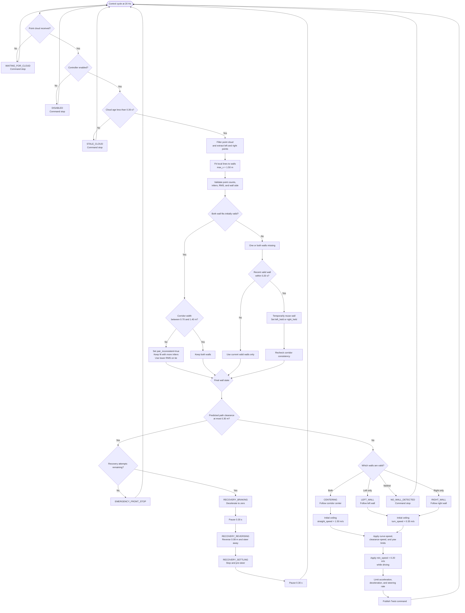

# Mapless Ackermann Wall-Follower Flowchart

## Wall Selection

| Detected walls | Controller behavior |
|---|---|
| Both valid and consistent | `CENTERING` |
| Both valid but inconsistent | Keep the higher-quality wall |
| Left only | `LEFT_WALL` |
| Right only | `RIGHT_WALL` |
| Brief detection dropout | Hold the recent wall for `0.20 s` |
| Neither valid after the hold | `NO_WALL_DETECTED` and stop |
| Path clearance at most `0.30 m` | Run the recovery sequence |

When a wall pair is inconsistent, the fit with more inliers is retained. If
both fits have the same number of inliers, the fit with the lower RMS error is
retained.
